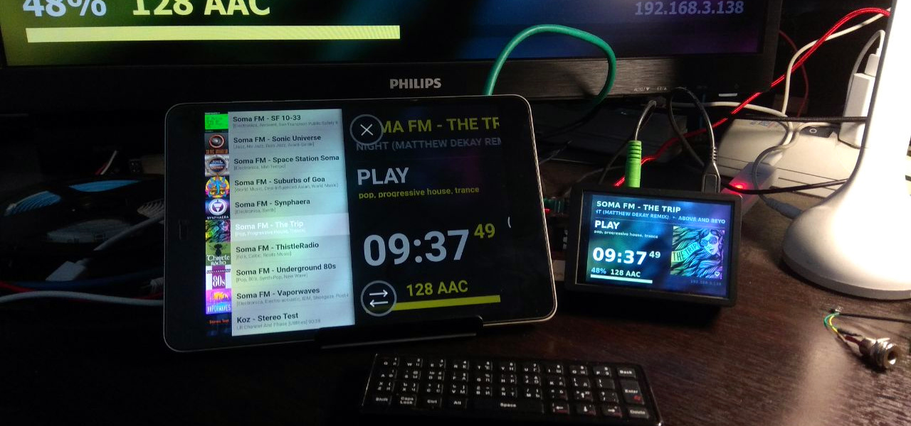
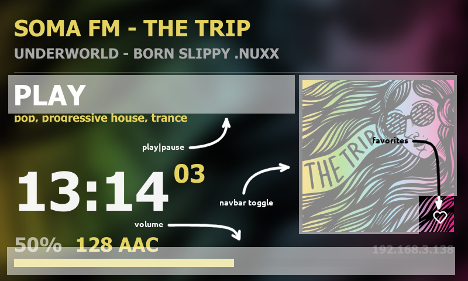
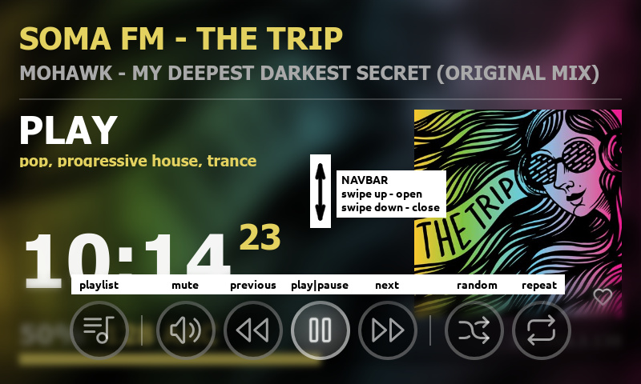
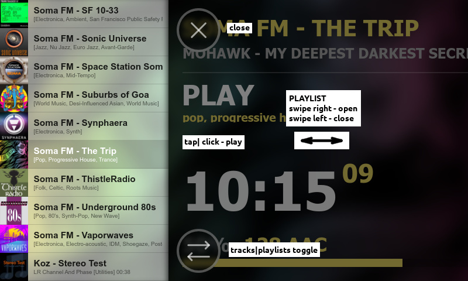

# moOde fAce
##### Client for moOde™ audio player https://moodeaudio.org



---
## 1. description
### 1.1 concept
- **backend** - one file
- **frontend** - one file
- the **service** runs as the user "nobody" and makes no changes to the Moode distribution files (except for the **"Favorites.m3u"** file).
- **adaptive** interface designed to work on displays of any resolution (at least that was the intention).

### 1.2 structure
- **/opt/moodeface/moodeface** - backend
- **/var/www/moodeface.html** - frontend
- **/etc/systemd/system/moodeface.service** - daemon
- **/tmp/moodeface.log** - log file
- **/tmp/moodeface.pid** - PID file
- **/tmp/mfpipe** - pipe file for processing external commands

### 1.3 functionalities
- this client does not replace all the features of [moode audio](https://moodeaudio.org), it is just an interface with basic playback control functions.
---
## 2. install

### 2.1.a manual
```
sudo apt install python3-websockets
git clone https://github.com/e2002/moodeface
cd moodeface
sudo mkdir -p /opt/moodeface
sudo cp moodeface /opt/moodeface
sudo chmod +x /opt/moodeface/moodeface
sudo cp moodeface.html /var/www/
sudo cp moodeface.service /etc/systemd/system/
sudo systemctl daemon-reload
sudo systemctl enable moodeface.service
sudo systemctl start moodeface.service
```
### 2.1.b from deb package
- download the latest deb from https://github.com/e2002/moodeface/releases/latest
- and install it
```
sudo apt install python3-websockets
sudo dpkg -i moodeface_*version*.deb
```

### 2.2 launch
- go to the link http://\<moodeip\>/moodeface.html
- or open the file moodeface.html?\<moodeip\> in your browser

### 2.2,5 optional, for Local UI:
modify **~/.xinitrc file** , replace
```
chromium-browser --app="http://localhost/" \
```
to
```
chromium-browser --app="http://localhost/moodeface.html" \

```
### 2.3 enjoy ;)
---
## 3. control
### 3.1 main screen


### 3.2 navbar


### 3.3 playlist


### 3.4 keyboard | air mouse
#### 3.4.1 main screen
- **KEY_LEFT** - previous
- **KEY_RIGHT** - next
- **KEY_UP** - vol up
- **KEY_DOWN** - vol down
- **KEY_ENTER** - play/pause
- **KEY_HOME** - open navbar

#### 3.4.2 navbar
- **KEY_LEFT** - walk left
- **KEY_RIGHT** - walk right
- **KEY_UP** - close navbar
- **KEY_DOWN** - close navbar
- **KEY_ENTER** - select
- **KEY_HOME** - toggle to playlist

#### 3.4.3 playlist
- **KEY_LEFT** - close playlist
- **KEY_RIGHT** - close playlist
- **KEY_UP** - walk up
- **KEY_DOWN** - walk down
- **KEY_ENTER** - play
- **KEY_HOME** - close playlist

**PS:** each command is bound to several keys. The full list of assigned keys can be seen in the file [moodeface.html](moodeface.html#L724)
### 3.5 triggerhappy
```
cat /etc/triggerhappy/triggers.d/media.conf

KEY_UP       1  echo up    > /tmp/mfpipe
KEY_UP       2  echo up    > /tmp/mfpipe
KEY_DOWN     1  echo down  > /tmp/mfpipe
KEY_DOWN     2  echo down  > /tmp/mfpipe
KEY_ENTER    0  echo enter > /tmp/mfpipe
KEY_LEFT     1  echo prev  > /tmp/mfpipe
KEY_RIGHT    1  echo next  > /tmp/mfpipe
```

## 4. history
#### v0.0.559 [2023.12.21]
- fixed a bug in displaying playback progress in portrait mode

#### v0.0.553 [2023.12.17]
- STOP instead of PAUSE for internet radio
- screen saver clock animation
- handling error loading album cover image
- handling websocket connection errors
- some fluctuations on the layout
- fixed reconnection when rebooting the system
- broadcast message when favorites are changed
- scroll long genre line

#### v0.0.501 [2023.12.15]
- optimization, refactoring
- bugs fixes

#### v0.0.415 [2023.12.11]
- fixed an error when restarting the service
- fixed crash reboot error when changing playlist
- fixed flickering of the album cover when changing tracks #2
- other minor fixes

#### v0.0.407 [2023.12.11]
- fixed flickering of the album cover when changing tracks

#### v0.0.400 [2023.12.11]
- first commit
---
